# 🎰 AleaSim: The Trinity Casino Architecture

**AleaSim** is a high-fidelity, enterprise-grade simulation of a modern gambling ecosystem. Built on the **Trinity Architecture**, it serves as a masterclass in building high-concurrency, mathematically deterministic, and cryptographically secure distributed systems.

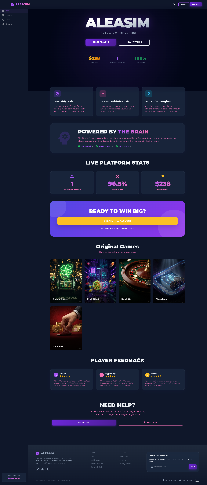
*Figure 1: AleaSim Landing Experience—gateway to the Trinity ecosystem for non-registered users.*

---

## 🎯 Executive Vision & System Purpose
AleaSim was engineered to bridge the gap between **high-stakes financial reliability** and **immersive psychological engagement**. The platform isn't just a collection of games; it's a living laboratory for behavioral AI, autonomous economy balancing, and industrial-grade transaction safeguarding.

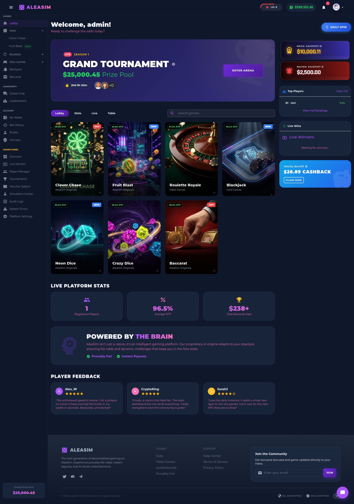
*Figure 2: The Player Lobby—central hub for authenticated users to access the game portfolio.*

### Core Strategic Pillars:
1.  **Trustless Fairness:** Every spin is a cryptographic proof. The house cannot cheat because the outcome is pre-determined by a seed-pair that the player can verify.
2.  **Financial Resilience:** Using the **Vault Sentinel** logic, the platform operates with the same integrity as a high-frequency trading desk.
3.  **Behavioral Flow:** The system uses "The Brain" (AI) to eliminate the "dry streaks" that kill user retention, smoothing out the variance without breaking the long-term RTP.

---

## 🏛️ 1. The Trinity Architecture: A Deep Dive
The system is decoupled into three distinct layers, each with a specialized responsibility. This separation of concerns allows for horizontal scaling and prevents "Leaky Abstractions" where game logic could impact financial data.

### 🏦 1.1 The Vault (Financial Guard & Ledger)
The Vault is the only layer authorized to touch the `Wallet` and `Transaction` tables.
- **Atomic Concurrency (Redis Redlock):** To prevent "Race Conditions" where a player might click "Spin" twice on two different devices simultaneously, the Vault locks the user's ID globally for the duration of the transaction.
- **Smart Solvency Protection:** Every win is pre-calculated against the `CasinoPool`. If a win would bankrupt a specific pool, the system dynamically reroutes the outcome or caps it, ensuring the platform remains solvent 24/7.
- **Idempotent Operations:** Every financial request carries a unique ID. If a request is re-sent due to a network glitch, the Vault identifies the ID and returns the previous result instead of deducting balance again.

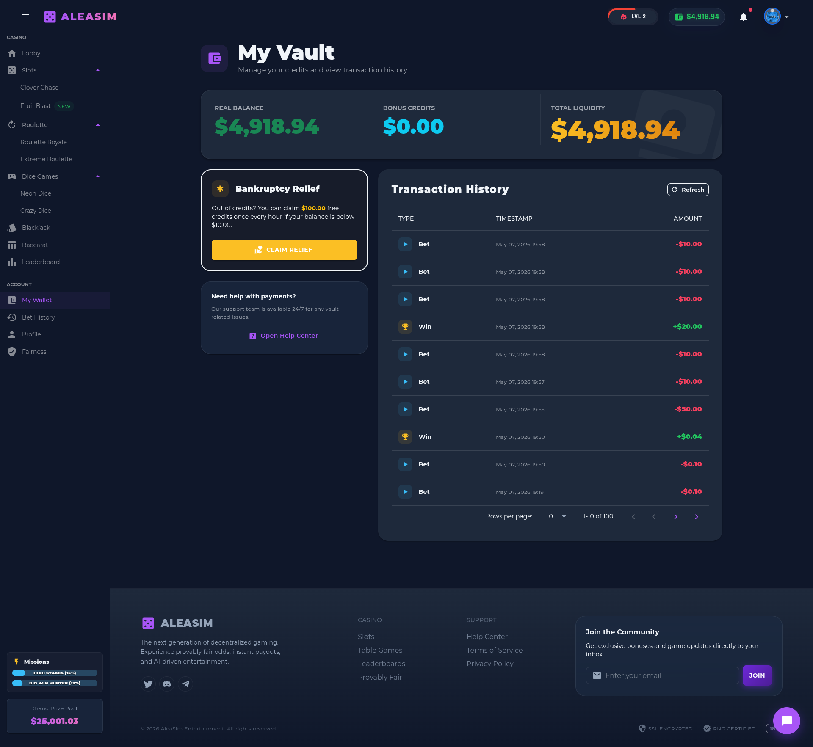
*Figure 3: The Player Wallet—real-time balance tracking with Bonus vs Real segregation.*

---

### 🧠 1.2 The Brain (Behavioral Intelligence Engine)
The Brain is the director of the experience. It doesn't decide *if* you win (that's the math), but it decides *when* to offer engagement features.
- **Retention Hooks:** Analyzes `LossStreakCount`. If a player is losing too fast, it injects a "Saver Bomb" or a "Near Miss" to trigger dopamine release and prevent churn.
- **Flow State Management:** Monitors click-speed. If a player is playing fast, it reduces animation times and increases the "Action Frequency" to maintain the immersive loop.
- **Weighted Directives:** Generates `BrainDirectives` stored in Redis. These tell the game engines to prefer certain visual patterns (like a 4-of-a-kind win) to hit the desired "Player Satisfaction" score.

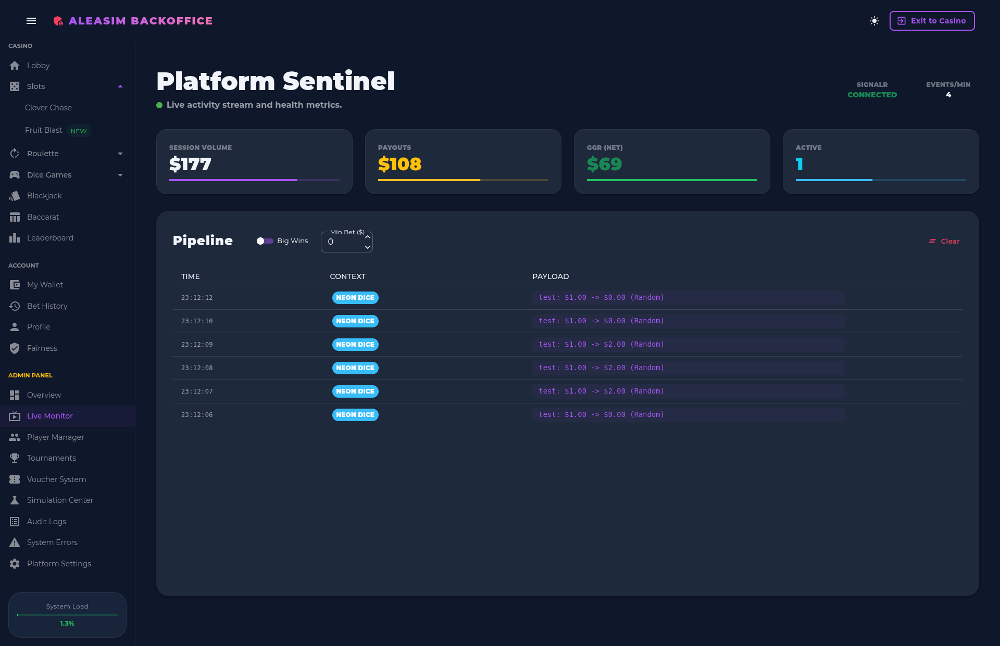
*Figure 4: Live Event Monitor—observing the Brain's real-time directives and outcomes.*

---

### ⚙️ 1.3 The Engines (Stateless Game Logic)
Engines are purely mathematical executors. They receive a directive and a seed, and they return a result.
- **Reconstruction Algorithm:** All active features (Respins, Sticky Wilds) are saved in Redis. If a player closes their tab, the Engine can "re-play" the state exactly as it was, providing a seamless "Resume" feature.
- **Deterministic Outcomes:** Given the same ServerSeed, ClientSeed, and Nonce, the Engine will *always* produce the identical grid. This is the foundation of our **Provably Fair** system.

---

## 🗄️ 2. Data Strategy & Persistence
AleaSim utilizes a hybrid storage model to achieve **sub-10ms response times** while maintaining **100% data durability**.

### 💿 2.1 MySQL/MariaDB (The Definitive Ledger)
- **Financial WAL (Write-Ahead Log):** Every credit/debit is recorded in a transactional ledger before the balance is updated.
- **Immutable Audit Trail:** All administrative actions (RTP changes, manual credits) are logged with a cryptographic hash of the previous log entry.
- **Relational Integrity:** Links every spin to a `GameRound` ID, a `Session` ID, and a `VaultTransaction` ID.

![DATABASE_SCHEMA_LINK]
*Figure 5: Core Entity-Relationship Diagram—linking Bets, Rounds, and Audits.*

### ⚡ 2.2 Redis (The Real-Time Pulse)
- **High-Velocity Locking:** Manages the `Redlock` distributed locks for all financial operations.
- **Social Backplane:** Powers the real-time chat and global winner notifications.
- **Caching Layer:** Stores the "Active Board" for slots, allowing for instant page refreshes without hitting the main database.

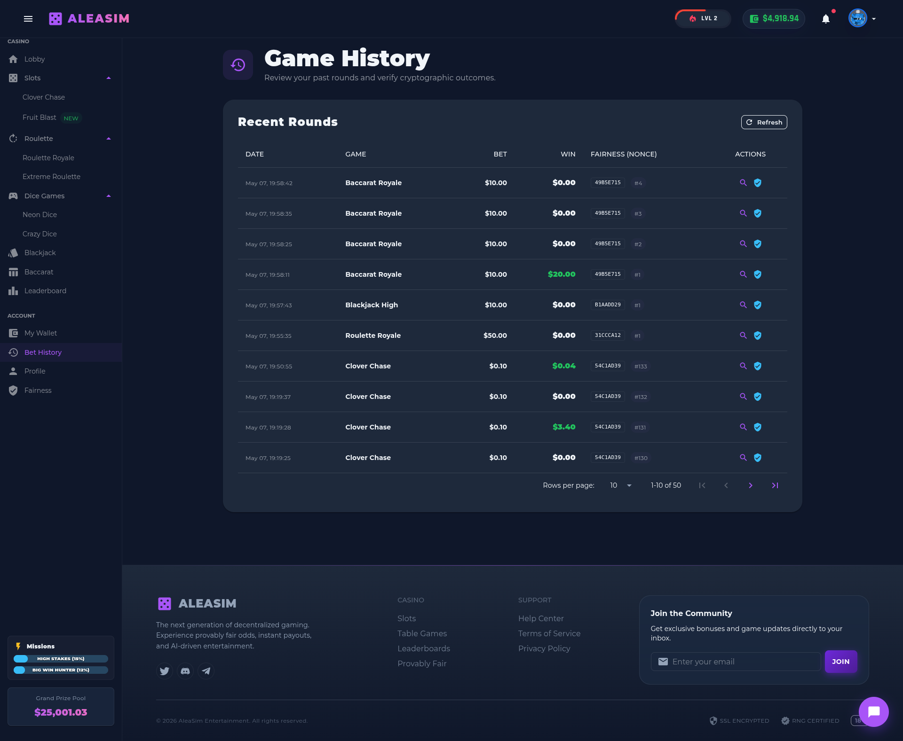
*Figure 6: Historical Ledger—viewing the settled results from the persistent storage.*

---

## 🎮 3. Game Portfolio: Mathematical Specs

### 🍀 3.1 Clover Chase (The Strategic Slot)
- **Paid Respin Mechanic:** Unlike "Free Spins," these are **Paid Respins**. Every spin costs a bet, but the **Sticky Wild Clovers (ID 8)** make a win almost guaranteed. This creates a high-turnover, high-reward loop that players love.
- **Bell Bonus (Hold & Win):** Collecting 5+ Clovers flips them into Bells.
    - **Multiplier Range:** 2x to 100x per bell.
    - **Jackpots:** Mini (1000x Denom) and Minor (5000x Denom) are fixed based on the denomination choice, incentivizing high-denom play.

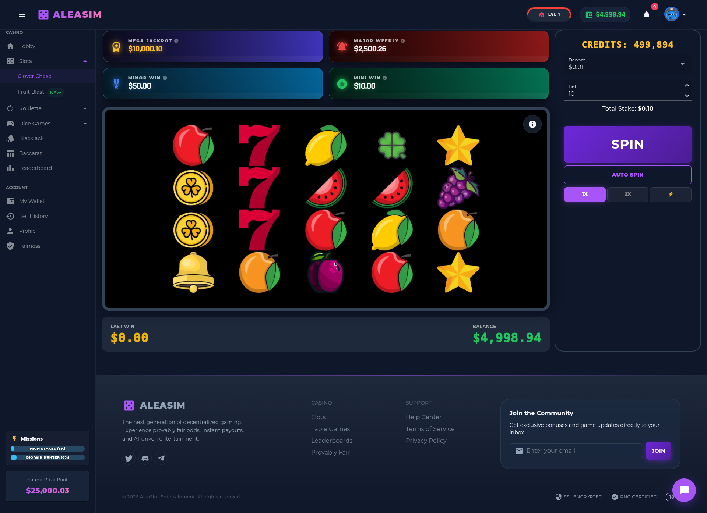
*Figure 7: Clover Chase—the sticky respin feature in action.*

---

### ☢️ 3.2 Fruit Blast Reactor (Cascading Chaos)
- **Recursive Avalanche:** A server-side algorithm that calculates win-cascades until no clusters remain.
- **Juice Meter Progression:**
    - **50 Points:** 2x Multiplier.
    - **100 Points:** 5x Multiplier.
    - **150 Points:** 10x Multiplier.
    - **200 Points (Meltdown):** **18x Multiplier** + award the total **Juice Reservoir Jackpot**.
- **Lifetime "Vitamin" Progression:** Every 5,000 exploded fruits awards a **3x3 Mega Golden Apple** (guaranteed massive win).

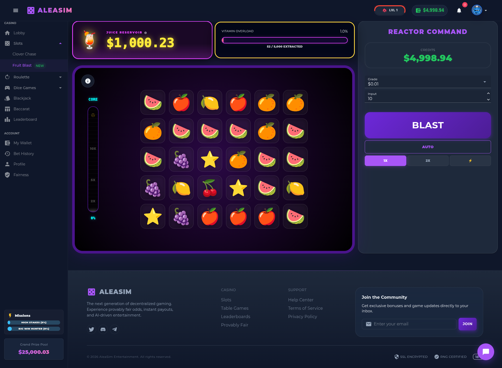
*Figure 8: Fruit Blast—cascading explosions filling the Juice Meter.*

---

### 🎲 3.3 Table & Original Games
- **Roulette Royale:** Features "Dynamic Multipliers" (up to 500x) on random numbers every spin.
- **Tactical Blackjack:** Multi-hand support with industrial-grade card-shuffling logic (Deterministic Deck).
- **Dice Games:** Neon Dice and Crazy Dice, using a simple but addictive "Over/Under" math model.

| 🎡 Roulette Royale | ♠️ Multi-Hand Blackjack |
| :---: | :---: |
| 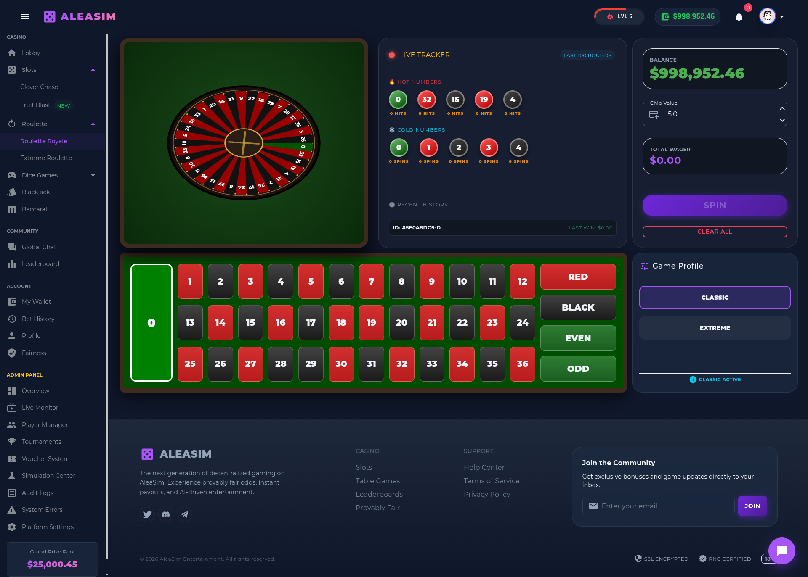 | 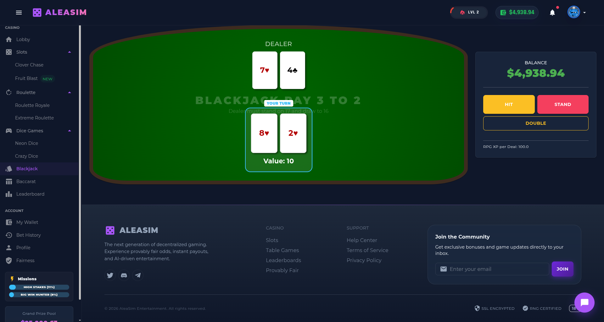 |

| 🎲 Neon Dice | 🎲 Crazy Dice |
| :---: | :---: |
| 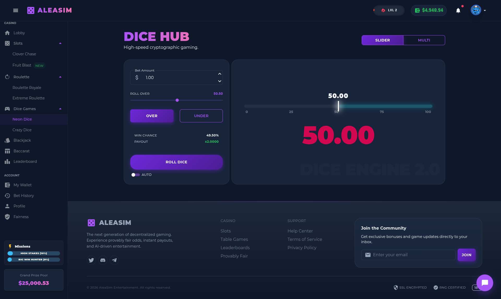 | 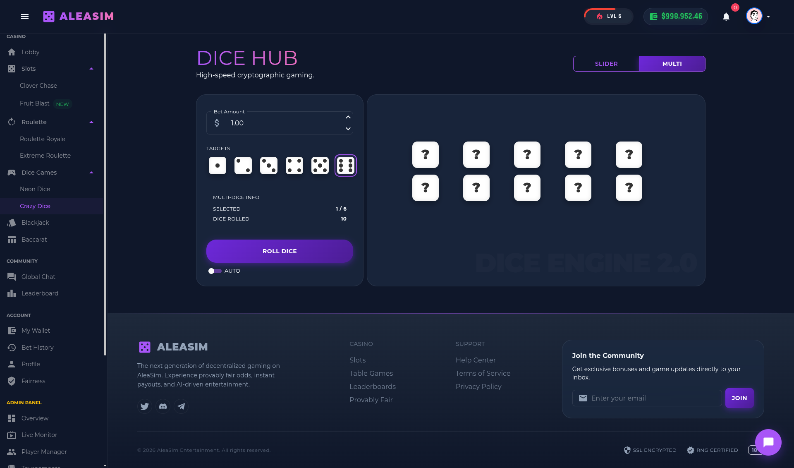 |

---

## 🛡️ 4. Security & Compliance Framework
- **HMAC-SHA256 Fairness:** The "Server Seed" is hashed and shown to the player *before* they play. They provide the "Client Seed." The result is the hash of both. This proves the house didn't change the result after seeing the bet.
- **Rate Limiting Middleware:** Prevents brute-force attacks and API abuse with a sliding window algorithm.
- **JWT HttpOnly Security:** Authentication tokens are stored in HttpOnly cookies to prevent XSS-based session theft.

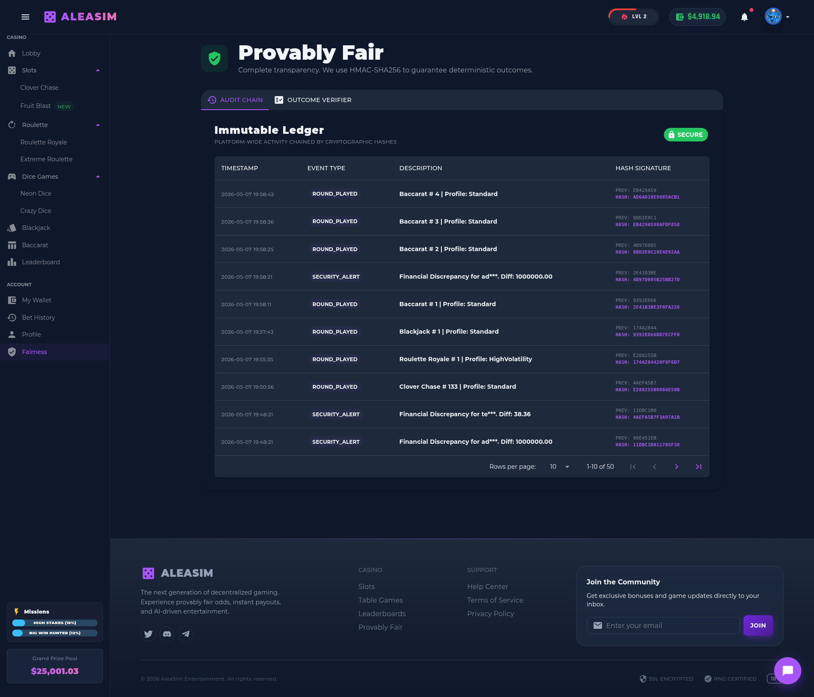
*Figure 9: Transparency Dashboard—where players can verify the cryptographic integrity of their spins.*

---

## 🛰️ 5. Real-Time Social & Social Engineering
AleaSim is designed to be "alive."
- **Global Winner Feed:** Every "Big Win" (over 10x bet) is broadcast via SignalR to every connected user.
- **Must-Drop Jackpots:** Progressive pools that are programmed to trigger before a specific dollar amount, creating "FOMO" (Fear Of Missing Out) and increasing spin-frequency.
- **Instagram-Style Chat:** A fully responsive, state-based chat system that feels native on mobile and desktop.

---

## 🛡️ 6. Administrative Command Suite (The Ops View)
The Admin Panel is a full-scale NOC (Network Operations Center) for the platform.

### 📊 6.1 Global Dashboard & Simulation
The simulation center allows admins to perform dry-runs of millions of spins to verify the mathematical stability of the platform.
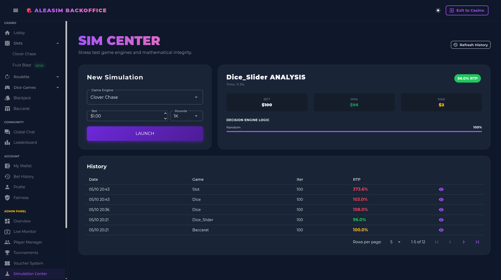
*Figure 10: Simulation Center—stress-testing the game engines at industrial scale.*

### 👥 6.2 Player Manager & Economics
Detailed control over user accounts, balances, and historical behavior.
| 📊 Admin Dashboard | 👥 Player Manager |
| :---: | :---: |
| 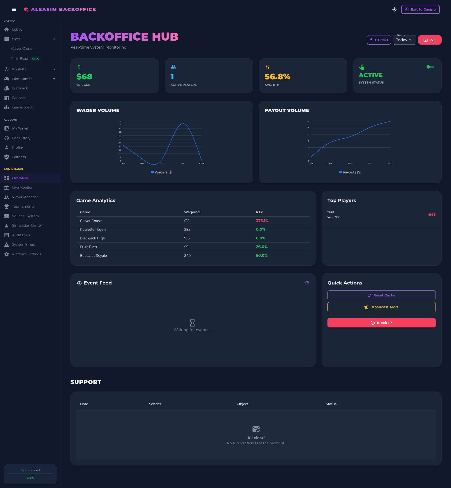 | 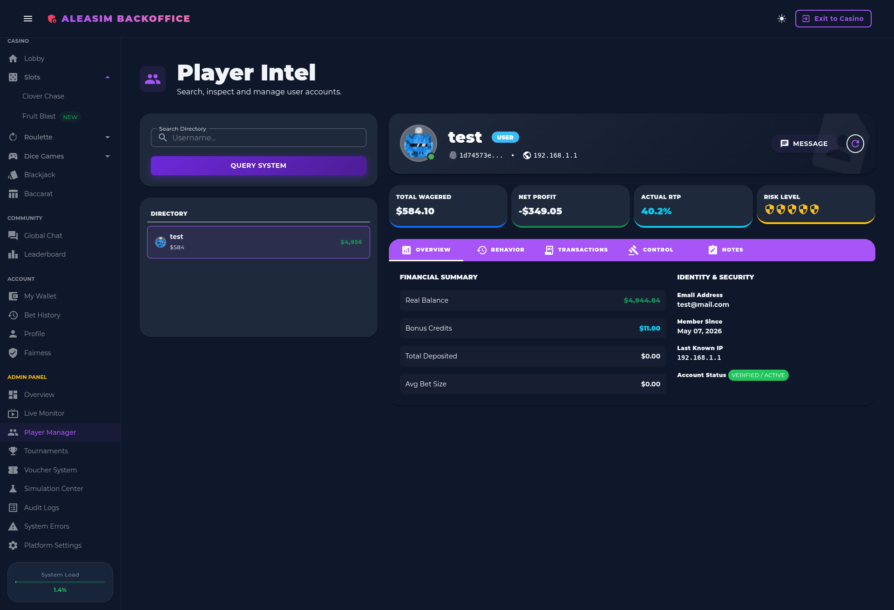 |

### ⚙️ 6.3 Configuration & Promo System
Real-time control over game parameters, tournament rules, and voucher distribution.
| ⚙️ Platform Settings | 🎟️ Voucher & Promo System |
| :---: | :---: |
| 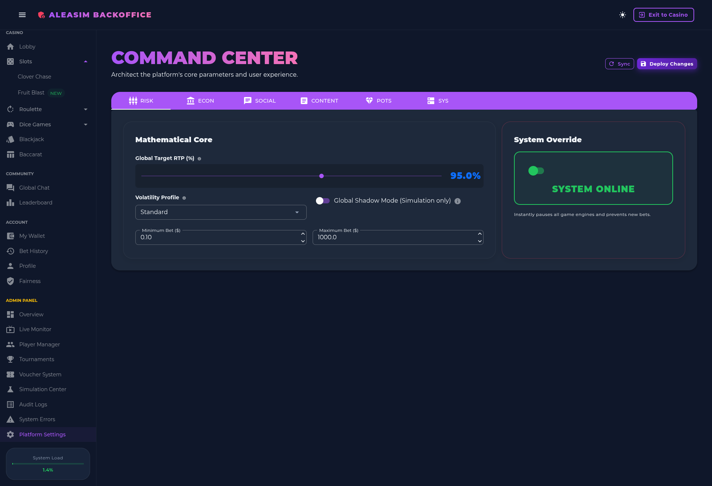 | 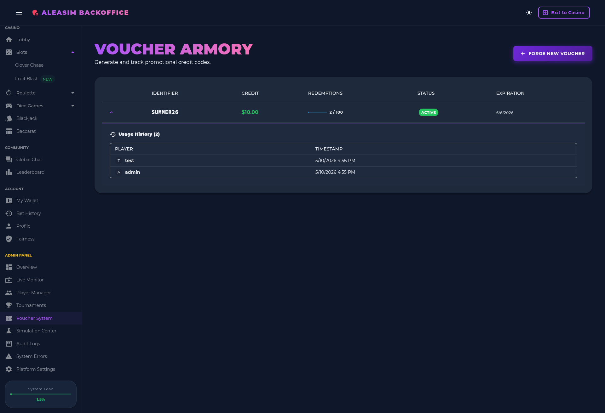 |

| 🏆 Tournament Management | 🛰️ Live Audit & Monitoring |
| :---: | :---: |
| 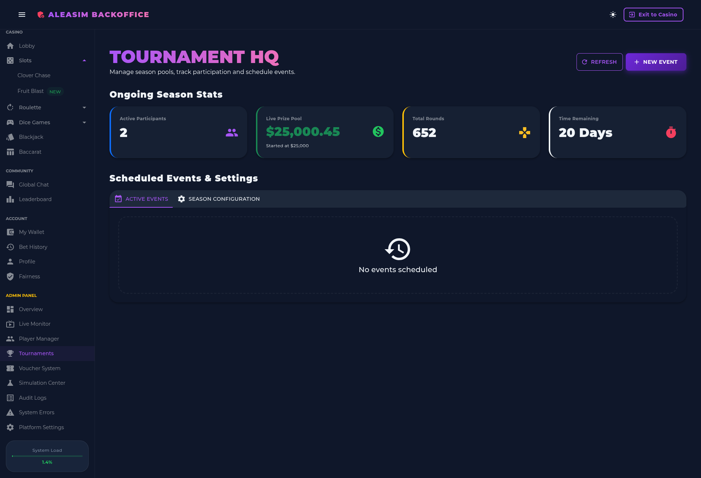 |  |

---

## 👤 7. User Experience & Personalization
Players have access to a rich set of tools to manage their experience, from detailed profiles to real-time social interaction.

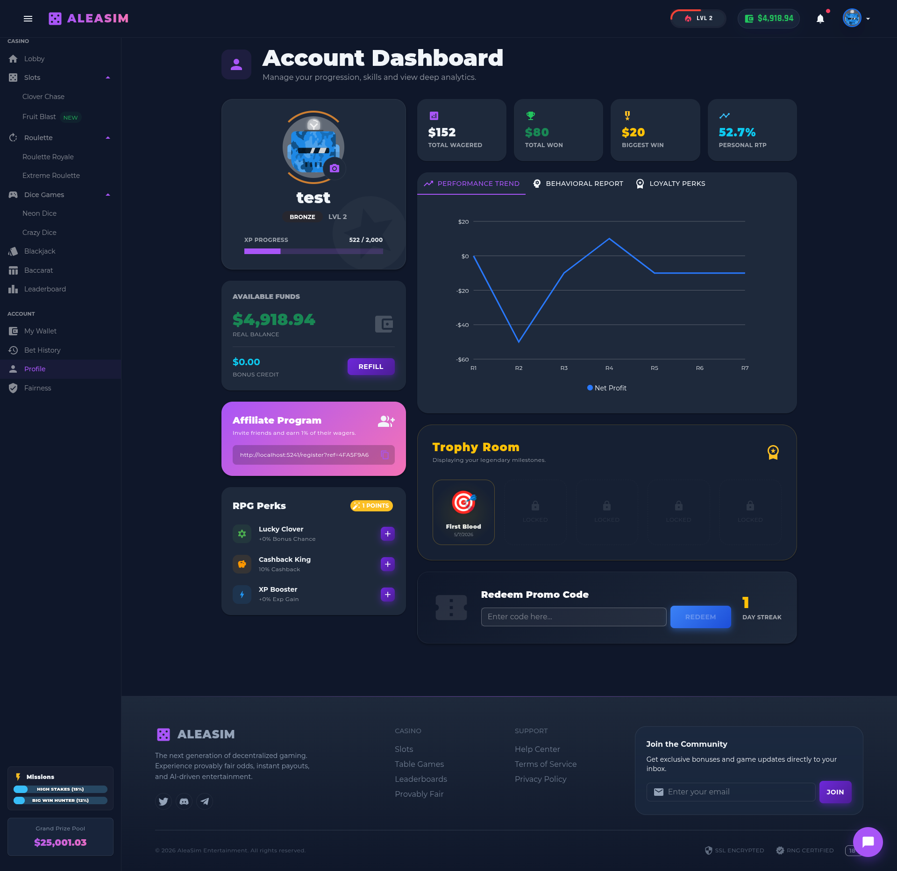
*Figure 11: Player Profile—managing achievements and personal settings.*

---

## 🚀 8. Technical Implementation & Scale
### Stack Overview:
- **Backend:** .NET 8 (C#), Entity Framework Core, SignalR.
- **Frontend:** Blazor WebAssembly (WASM), MudBlazor, PixiJS (Game Rendering).
- **Caching/State:** Redis (Redlock, SignalR Backplane).
- **Database:** MySQL 8.0 / MariaDB.
- **CI/CD & Hosting:** k3s (Kubernetes) Cluster with Dockerized Microservices.

---

## 📈 9. Future Roadmap: The AI Frontier
1.  **RiskSense AI:** Neural network integration for real-time detection of "Botting" and "Arbitrage" patterns.
2.  **Multi-Instance Sync:** Supporting 100,000+ concurrent players across globally distributed k8s nodes.
3.  **Content SDK:** Allowing 3rd party developers to build games using our Trinity Contracts.

---

*© 2026 AleaSim Entertainment. Architected for extreme performance, cryptographic security, and mathematical integrity.*
