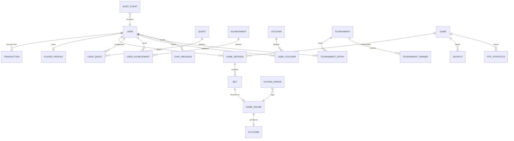
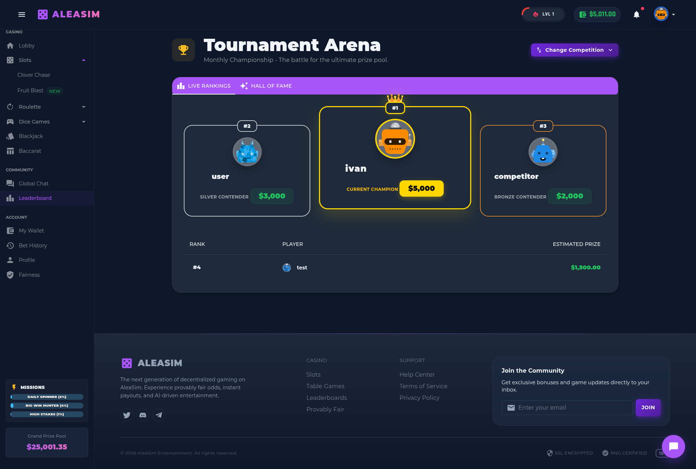

# 🎰 AleaSim: The Trinity Casino Architecture

**AleaSim** is a high-fidelity, enterprise-grade simulation of a modern gambling ecosystem. Built on the **Trinity Architecture**, it serves as a masterclass in building high-concurrency, mathematically deterministic, and cryptographically secure distributed systems.

---

## 🎯 Executive Vision & System Purpose
AleaSim was engineered to bridge the gap between **high-stakes financial reliability** and **immersive psychological engagement**. The platform isn't just a collection of games; it's a living laboratory for behavioral AI, autonomous economy balancing, and industrial-grade transaction safeguarding.

### 🏠 Landing & Navigation Experience
The system provides two distinct entry points tailored to the user's authentication state, ensuring a high-conversion registration funnel and a socially-active member area.

**Guest Experience (Non-Registered):**

*Figure 1: Public Landing Page—Showcasing the platform portfolio, hot games, and registration entry points.*

**Member Experience (Authenticated Lobby):**

*Figure 2: Registered User Lobby—The central dashboard for game navigation, live winner feeds, and social interaction.*

### Core Strategic Pillars:
1.  **Trustless Fairness:** Every spin is a cryptographic proof. The house cannot cheat because the outcome is pre-determined by a seed-pair that the player can verify.
2.  **Financial Resilience:** Using the **Vault Sentinel** logic, the platform operates with the same integrity as a high-frequency trading desk.
3.  **Behavioral Flow:** The system uses "The Brain" (AI) to eliminate the "dry streaks" that kill user retention, smoothing out the variance without breaking the long-term RTP.

---

## 🏛️ 1. The Trinity Architecture: A Deep Dive
The system is decoupled into three distinct layers, each with a specialized responsibility. This separation of concerns allows for horizontal scaling and prevents "Leaky Abstractions" where game logic could impact financial data.

### 🏦 1.1 The Vault (Financial Guard & Ledger)
The Vault is the only layer authorized to touch the `Wallet` and `Transaction` tables.
- **Atomic Concurrency (Redis Redlock):** To prevent "Race Conditions" where a player might click "Spin" twice on two different devices simultaneously, the Vault locks the user's ID globally for the duration of the transaction.
- **Smart Solvency Protection:** Every win is pre-calculated against the `CasinoPool`. If a win would bankrupt a specific pool, the system dynamically reroutes the outcome or caps it, ensuring the platform remains solvent 24/7.
- **Dual Wallet Prioritization:** Bonus funds are automatically consumed before real cash, with real-time wagering requirement tracking.

*Figure 3: The Player Wallet—Advanced financial management with segregated balance tracking.*

---

### 🧠 1.2 The Brain (Behavioral Intelligence Engine)
The Brain is the director of the experience. It doesn't decide *if* you win (that's the math), but it decides *when* to offer engagement features.
- **Retention Hooks:** Analyzes `LossStreakCount`. If a player is losing too fast, it injects a "Saver Bomb" or a "Near Miss" to trigger dopamine release and prevent churn.
- **Flow State Management:** Monitors click-speed. If a player is playing fast, it reduces animation times and increases the "Action Frequency" to maintain the immersive loop.
- **Dynamic Directives:** Generates AI-driven `BrainDirectives` stored in Redis that modulate game volatility in real-time based on player history.

*Figure 4: Live Event Monitor—Real-time observation of the Brain's directives and system-wide win/loss distribution.*

---

### ⚙️ 1.3 The Engines (Stateless Game Logic)
Engines are purely mathematical executors. They receive a directive and a seed, and they return a result.
- **Reconstruction Algorithm:** All active features (Respins, Sticky Wilds) are saved in Redis. If a player closes their tab, the Engine can "re-play" the state exactly as it was, providing a seamless "Resume" feature.
- **Deterministic Outcomes:** Given the same ServerSeed, ClientSeed, and Nonce, the Engine will *always* produce the identical grid. This is the foundation of our **Provably Fair** system.

---

## 🗄️ 2. Data Strategy & Persistence
AleaSim utilizes a hybrid storage model to achieve **sub-10ms response times** while maintaining **100% data durability**.

### 💿 2.1 MySQL/MariaDB (The Definitive Ledger)
The relational schema ensures ACID compliance for every financial and profile state change. The following diagram illustrates the complexity and interconnectivity of the 25+ core entities.

*Figure 5: Enterprise Entity-Relationship Diagram—Mapping the 100% relational integrity of the AleaSim ecosystem.*

*Figure 6: Historical Ledger—Drilling down into individual game rounds with full cryptographic proof strings.*

---

## 🎮 3. Game Portfolio: Mathematical Specs

### 🍀 3.1 Clover Chase (The Strategic Slot)

*Figure 7: Clover Chase—The high-volatility sticky respin engine.*

- **Paid Respin Mechanic:** Triggered by any Clover. Every spin costs a bet, but Sticky Wild Clovers make a win almost guaranteed.
- **Bell Bonus (Hold & Win):** Transitions to a 20-cell grid of only Bells and Blanks. Multipliers up to 100x.
- **Jackpot Tiers:** Mini (1000x) and Minor (5000x) denomination-based jackpots.

---

### ☢️ 3.2 Fruit Blast Reactor (Cascading Chaos)

*Figure 8: Fruit Blast—Recursive avalanche engine with progressive multipliers.*

- **Juice Meter Progression:** Reaching 200 points triggers an **18x Multiplier** and awards the **Juice Reservoir Jackpot**.
- **Vitamin Overload:** At 5,000 exploded fruits, the system injects a **3x3 Mega Golden Apple** for massive cluster pays.

---

### 🎲 3.3 Table & Original Games

| 🎡 Roulette Royale | ♠️ Multi-Hand Blackjack |
| :---: | :---: |
|  |  |

| 🎲 Neon Dice | 🎲 Crazy Dice |
| :---: | :---: |
|  |  |

---

## 🛡️ 4. Security & Compliance Framework

*Figure 9: Transparency Dashboard—Empowering players to verify the mathematical integrity of every single outcome.*

- **HMAC-SHA256 Fairness:** Outcomes are derived from a pre-revealed ServerSeed hash and a player-provided ClientSeed.
- **Rate Limiting:** Industrial-grade throttling on financial endpoints to mitigate automated arbitrage attempts.
- **Write-Ahead Logging:** Critical financial events are persisted to the WAL before being broadcast to the client UI.

---

## 🛡️ 5. Administrative Command Suite (The Ops View)
The AleaSim Admin Panel provides 360-degree observability and control over the platform's health and economy.

### 📊 5.1 Simulation & Math Verification
The simulation center allows admins to perform dry-runs of millions of spins to verify mathematical stability and RTP convergence.

*Figure 10: Simulation Center—Industrial-scale stress testing of game engines.*

### 📊 5.2 Global Analytics Dashboard
Real-time tracking of platform KPIs, active users, and global pool balances.

*Figure 11: Global KPIs and real-time platform health monitoring.*

---

### 👥 5.3 Player Manager & Economics
Detailed control over user accounts, balances, and historical behavior.

*Figure 12: Player Management—Deep-dive into individual user activity and financial status.*

---

### ⚙️ 5.4 Configuration & Promo System
Real-time control over game parameters, tournament rules, and voucher distribution.

**Platform Configuration:**

**Voucher & Promo Management:**

**Live Audit & Monitoring:**

**Tournament Operations:**

---

## 👤 6. User Experience & Personalization
Players have access to a rich set of tools to manage their experience, from RPG progression to real-time competition.

*Figure 13: Player Profile—Managing achievements, XP levels, and personal security settings.*

*Figure 14: Competitive Ecosystem—Real-time ROI leaderboards promoting fair competition.*

---

## 🚀 7. Technical Implementation & Scale
### Stack Overview:
- **Backend:** .NET 8 (C#), Entity Framework Core 8, SignalR (WebSockets).
- **Frontend:** Blazor WebAssembly (WASM), MudBlazor, PixiJS (Game Rendering).
- **Caching/State:** Redis (Redlock, SignalR Backplane).
- **Database:** MySQL 8.0 / MariaDB.
- **CI/CD & Hosting:** k3s (Kubernetes) Cluster with Dockerized Microservices.

---

## 📈 8. Future Roadmap: The AI Frontier
1.  **RiskSense AI:** Neural network integration for real-time detection of botting patterns.
2.  **Tournament 2.0:** Dynamic prize pools that scale with participation volume.
3.  **Content SDK:** Allowing 3rd party developers to build games using the Trinity Architecture.

---

*© 2026 AleaSim Entertainment. Architected for extreme performance, cryptographic security, and mathematical integrity.*
